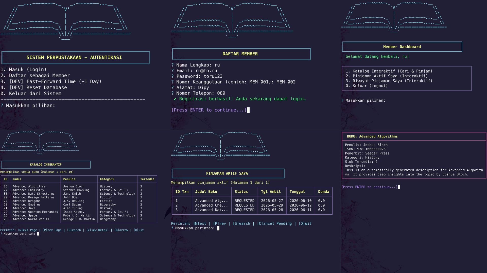
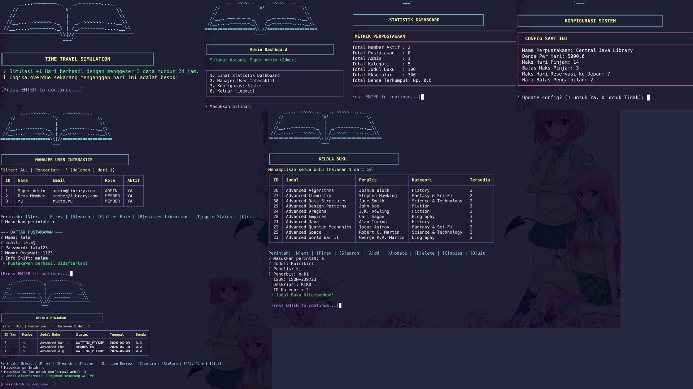

# PBO Sistem Perpustakaan — Library Management System

Java · Apache Ant · NetBeans · MySQL · OOP/DDD

---

## Architecture

**N-Tier layered architecture. Each layer has one job. No layer skips a layer.**

```
Presentation  →  Service  →  Repository  →  MySQL
(tui / ui)        (logic)      (SQL)
                  ↓
              Domain (entities, enums, interfaces)
```

| Layer | Package | Responsibility |
|---|---|---|
| Presentation | `tui`, `ui` | Input/output only. Zero business logic. |
| Service | `service` | All business rules, validation, state transitions, schedulers. |
| Domain | `domain.entities`, `domain.enums`, `domain.interfaces` | Data models and contracts. |
| Repository | `repository` | SQL queries. Translates `ResultSet` ↔ Java objects. |
| Config/Util | `config`, `util` | DB connection, `PasswordHasher`, `FineCalculator`. |

**Core rules:**
- Domain entities hold state only — no business logic methods like `requestBorrow()` or `calculateFine()`.
- All business actions go through the Service layer.
- UI never touches the repository or database directly.
- `BookTitle` (catalog idea) is strictly separated from `BookCopy` (physical item on shelf).
- One `LoanTransaction` = one `Member` + one `BookCopy`. Never batched.

---

## Project Structure

```
sistem-perpustakaan/src/com/library/
├── app/
│   ├── Main.java                  ← ONLY entry point for the full TUI app
│   ├── MainAuth.java              ← AuthService integration tests (7 tests)
│   ├── MainBook.java              ← BookService integration tests (19 tests)
│   ├── MainCategory.java          ← CategoryService integration tests (19 tests)
│   ├── MainConfig.java            ← ConfigService integration tests (12 tests)
│   ├── MainLoan.java              ← LoanService integration tests (9 tests)
│   └── MainUser.java              ← UserService integration tests (25 tests)
├── config/
│   └── DatabaseConfig.java        ← JDBC connection (URL, user, password)
├── domain/
│   ├── entities/
│   │   ├── User.java              ← abstract base class
│   │   ├── Member.java            ← extends User; membershipNumber, address, phone, MemberStatus
│   │   ├── Librarian.java         ← extends User; employeeNumber, shiftInfo
│   │   ├── Admin.java             ← extends User; no extra fields
│   │   ├── BookTitle.java         ← catalog entry; implements ISearchable
│   │   ├── BookCopy.java          ← physical item; has BookCopyStatus
│   │   ├── Category.java          ← implements IAuditable; soft-deletable
│   │   ├── LoanTransaction.java   ← implements IAuditable; core transaction record
│   │   ├── LibraryConfig.java     ← singleton-like config row in DB
│   │   └── DashboardStats.java    ← DTO for Admin stats view
│   ├── enums/
│   │   ├── UserRole.java          ← MEMBER, LIBRARIAN, ADMIN
│   │   ├── MemberStatus.java      ← ACTIVE, SUSPENDED
│   │   ├── BookCopyStatus.java    ← AVAILABLE, RESERVED, LOANED, UNAVAILABLE
│   │   ├── LoanStatus.java        ← REQUESTED, WAITING_PICKUP, ACTIVE, OVERDUE, RETURNED, EXPIRED, CANCELLED
│   │   └── BorrowType.java        ← ONLINE, OFFLINE
│   └── interfaces/
│       ├── IAuditable.java        ← getCreatedAt(), getUpdatedAt(), getCreatedBy()
│       └── ISearchable.java       ← matchesKeyword(String keyword): boolean
├── exception/                     ← reserved for custom business exceptions (currently empty)
├── repository/
│   ├── IRepository.java           ← generic: save, update, delete, findById, findAll
│   ├── IUserRepository.java
│   ├── IBookTitleRepository.java
│   ├── IBookCopyRepository.java
│   ├── ICategoryRepository.java
│   ├── ILoanTransactionRepository.java
│   └── ILibraryConfigRepository.java
│   └── *MySQLImpl.java            ← concrete SQL implementations
├── service/
│   ├── AuthService.java
│   ├── UserService.java
│   ├── BookService.java
│   ├── CategoryService.java
│   ├── LoanService.java
│   ├── ConfigService.java
│   └── ReportService.java
├── tui/
│   ├── TuiController.java         ← main loop; routes by UserRole after login
│   ├── util/TuiUtils.java         ← ANSI colors, table printer, input helpers
│   └── views/
│       ├── AuthView.java          ← login + register screens
│       ├── MemberView.java        ← member dashboard
│       ├── LibrarianView.java     ← librarian dashboard
│       └── AdminView.java         ← admin dashboard
├── ui/                            ← Java Swing GUI (under development)
└── util/
    ├── FineCalculator.java        ← fine = max(0, days_overdue) × finePerDay
    └── PasswordHasher.java        ← SHA-256 hash + verify
```

---

## Domain Model

### Enums (all business states)

| Enum | Values |
|---|---|
| `UserRole` | `MEMBER`, `LIBRARIAN`, `ADMIN` |
| `MemberStatus` | `ACTIVE`, `SUSPENDED` — tracked separately from `User.active` boolean |
| `BookCopyStatus` | `AVAILABLE`, `RESERVED`, `LOANED`, `UNAVAILABLE` |
| `LoanStatus` | `REQUESTED`, `WAITING_PICKUP`, `ACTIVE`, `OVERDUE`, `RETURNED`, `EXPIRED`, `CANCELLED` |
| `BorrowType` | `ONLINE`, `OFFLINE` — stamped on every `LoanTransaction` at creation |

**`MemberStatus` vs `User.active`**: `User.active` is the authentication gate (false = cannot log in). `MemberStatus.SUSPENDED` is a business-layer status. When `suspendUser` is called, both are set simultaneously.

### Key Entity Fields

**`User` (abstract)**
`id`, `name`, `email`, `passwordHash`, `role`, `active`, `createdAt`, `updatedAt`
Abstract methods: `getDashboardTitle(): String`, `getPermissions(): List<String>`
Implements `IAuditable`.

**`Member extends User`**
Extra: `membershipNumber`, `address`, `phone`, `status: MemberStatus`

**`Librarian extends User`**
Extra: `employeeNumber`, `shiftInfo`

**`Admin extends User`**
No extra fields. Inherits everything from `User`.

**`BookTitle`**
`id`, `title`, `author`, `publisher`, `isbn`, `description`, `category (Category ref)`
Implements `ISearchable` — `matchesKeyword()` checks title, author, and ISBN.

**`BookCopy`**
`id`, `bookTitle (BookTitle ref)`, `location`, `status: BookCopyStatus`
Method: `canBeBorrowed(): boolean` — returns `status == AVAILABLE`.

**`LoanTransaction`** — most important entity
`id`, `member (Member ref)`, `bookCopy (BookCopy ref)`, `borrowType`, `requestDate`, `scheduledPickupDate`, `dueDate`, `returnDate`, `status: LoanStatus`, `fineAmount`, `finePerDaySnapshot`, `fineCalculatedAt`, `approvedBy (Librarian ref)`, `fineProcessedBy (Librarian ref)`, `finePaidAt`, `cancelledAt`

**`LibraryConfig`**
`finePerDay`, `maxBorrowDays`, `maxBorrowLimit`, `maxReservationDaysAhead`, `pickupWindowDays`, `libraryName`, `libraryDescription`

**`DashboardStats`** (DTO, never persisted)
Fields: `totalActiveMembers`, `totalLibrarians`, `totalAdmins`, `totalCategories`, `totalBookTitles`, `totalBookCopies`, `totalFineCollected`

### Interfaces

**`IAuditable`** — implemented by `User`, `Category`, `LoanTransaction`
```java
LocalDateTime getCreatedAt();
LocalDateTime getUpdatedAt();
String getCreatedBy();
```

**`ISearchable`** — implemented by `BookTitle`, `Member`
```java
boolean matchesKeyword(String keyword);
```

**`IRepository<T, ID>`** — implemented by all repository interfaces
```java
void save(T entity);
void update(T entity);
void delete(ID id);
T findById(ID id);
List<T> findAll();
```

---

## OOP Implementation

### 1. Encapsulation
All entity fields are `private`. Access is via getters/setters. `LoanTransaction` holds `private Member member` and `private BookCopy bookCopy` (object references, not integer foreign keys). The repository reconstructs these full object graphs from SQL joins during `findById`.

### 2. Inheritance
`User` is `abstract` — cannot be instantiated directly. `Member`, `Librarian`, and `Admin` extend it. Common identity fields (`id`, `email`, `passwordHash`) are defined once in `User`.

### 3. Abstract Class + Interface
`User` abstract prevents `new User()`. `IAuditable` forces audit fields on `User`, `Category`, `LoanTransaction`. `ISearchable` enables generic keyword search on `BookTitle` and `Member`. `IRepository<T,ID>` generic interface prevents duplicate CRUD boilerplate across 6 repository implementations.

### 4. Polymorphism + Dynamic Binding
`AuthService.login()` returns a `User` reference. `TuiController` calls `user.getRole()` to route to the correct view. Inside each view, `user.getDashboardTitle()` is called — JVM dispatches to the correct subclass override at runtime (dynamic dispatch). No `instanceof` checks needed in the controller.

```java
// TuiController.java — actual routing code
if (currentUser.getRole() == UserRole.MEMBER)       new MemberView(...).showMenu();
else if (currentUser.getRole() == UserRole.LIBRARIAN) new LibrarianView(...).showMenu();
else if (currentUser.getRole() == UserRole.ADMIN)    new AdminView(...).showMenu();
```

### 5. Generics
`IRepository<T, ID>` — `IBookCopyRepository extends IRepository<BookCopy, Integer>`. Type-safe, no casting needed in service methods.

### 6. Collections
`List<BookTitle>`, `List<LoanTransaction>` returned by repositories and filtered in service/view layers using Java Streams (`.filter()`, `.collect()`).

### 7. Exception Handling
Currently uses standard Java exceptions. The `exception` package is reserved for custom business exceptions (`BookUnavailableException`, `QuotaExceededException`) planned for a future iteration.

| Exception type | When thrown |
|---|---|
| `IllegalArgumentException` | Invalid input: null/empty fields, bad dates, non-existent IDs |
| `IllegalStateException` | Invalid state transition: already suspended, already returned, quota exceeded |
| `SecurityException` | Permission check failed: Member trying to do Librarian/Admin action |

### 8. Persistence
`*MySQLImpl` classes execute raw JDBC SQL. They reconstruct full object graphs: e.g., `LoanTransactionRepositoryMySQLImpl.findById()` joins `loans`, `users`, `book_copies`, and `book_titles` in one query and returns a fully populated `LoanTransaction` object.

---

## Service Layer — Actual Methods

### `AuthService`
| Method | Description |
|---|---|
| `login(email, password): User` | Hashes input with `PasswordHasher`, compares against stored hash. Throws `IllegalArgumentException` for wrong credentials, `IllegalStateException` for inactive accounts. Returns concrete subclass (`Member`, `Librarian`, or `Admin`). |
| `registerMember(name, email, password, membershipNumber, address, phone): void` | Validates non-empty fields, unique email. Hashes password before save. |

### `UserService`
| Method | Description |
|---|---|
| `getUserById(id): User` | Throws `IllegalArgumentException` if not found. |
| `getAllUsers(): List<User>` | All users regardless of role. |
| `getUsersByRole(UserRole): List<User>` | Filtered by role. |
| `registerLibrarian(actor, librarian, rawPassword): Librarian` | Admin-only (`SecurityException` if not). Validates email uniqueness (`IllegalStateException` if duplicate), password min 6 chars. Hashes password. |
| `suspendUser(actor, userId): void` | Admin-only. Sets `active=false` and `MemberStatus.SUSPENDED`. Throws `IllegalStateException` if already suspended. |
| `activateUser(actor, userId): void` | Admin-only. Sets `active=true` and `MemberStatus.ACTIVE`. Throws `IllegalStateException` if already active. |
| `resetPasswordToDefault(actor, userId, newRawPassword): void` | Admin-only. Hashes and saves new password. Min 6 chars enforced. |
| `updateUserInfo(actor, user): void` | Admin-only. Validates email uniqueness against other accounts. Throws if user not found. |
| `deleteUser(actor, userId): void` | Admin-only. **Soft delete** — sets `active=false`, record remains in DB. |

### `BookService`
| Method | Description |
|---|---|
| `addBookTitle(actor, title, author, publisher, isbn, desc, category): void` | Librarian/Admin only. ISBN must be unique. Null/empty title or ISBN throws `IllegalArgumentException`. |
| `updateBookTitle(actor, id, title, author, publisher, isbn, desc, category): void` | ISBN uniqueness check excludes the book being updated (self-update with same ISBN allowed). |
| `deleteBookTitle(actor, id): void` | Throws `IllegalArgumentException` if ID not found. |
| `addBookCopies(actor, titleId, count, location): void` | `count` must be > 0. Throws if `titleId` not found. |
| `updateBookCopy(actor, copyId, status, location): void` | Updates location. If `status` is non-null, also updates `BookCopyStatus`. |
| `updateCopyStatus(actor, copyId, status): void` | Dedicated status update. Null status throws `IllegalArgumentException`. |
| `deleteBookCopy(actor, copyId): void` | Hard delete of a single copy. |
| `searchCatalog(keyword): List<BookTitle>` | Null or empty keyword returns all books. Otherwise searches title, author, ISBN via `ISearchable.matchesKeyword()`. |
| `getAvailableStock(titleId): int` | Count of copies with `status = AVAILABLE`. |
| `getTotalCopies(titleId): int` | Count of all copies regardless of status. |
| `findAvailableCopyByTitleId(titleId): BookCopy` | Returns one `AVAILABLE` copy for online borrowing. |

### `CategoryService`
| Method | Description |
|---|---|
| `createCategory(actor, name, description): void` | Librarian/Admin only. Unique name enforced against both active and inactive categories. Duplicate against an inactive category throws with a hint to reactivate instead. |
| `updateCategory(actor, id, name, description): void` | Name uniqueness excludes the category itself. |
| `updateCategory(actor, id, name): void` | Overloaded — updates name only; description unchanged. |
| `deleteCategory(actor, id): void` | **Soft delete** — sets `isActive=false`. Record remains for historical references. |
| `reactivateCategory(actor, id): void` | Restores `isActive=true`. Throws if already active or not found. |
| `getAllActiveCategories(): List<Category>` | Used in TUI dropdowns. Excludes soft-deleted categories. |

### `LoanService`
| Method | Description |
|---|---|
| `requestOnlineLoan(member, bookCopy, pickupDate): LoanTransaction` | Creates `REQUESTED` status. Validates: `pickupDate` must be tomorrow to `today + maxReservationDaysAhead`. Copy must be `AVAILABLE`. Member's active loan count must be < `maxBorrowLimit`. Sets copy to `RESERVED`. |
| `createOfflineLoan(member, bookCopy, librarian): LoanTransaction` | Creates `ACTIVE` status directly. `dueDate = today + maxBorrowDays`. Sets copy to `LOANED`. |
| `confirmPickup(txnId, librarian): void` | `WAITING_PICKUP → ACTIVE`. Sets `approvedBy`. Does not recalculate `dueDate` (already set at creation). |
| `processReturn(txnId, librarian): void` | `ACTIVE` or `OVERDUE → RETURNED`. Calls `FineCalculator`, snapshots `fineAmount` and `finePerDaySnapshot`. Sets copy to `AVAILABLE`. |
| `cancelLoan(txnId, member): void` | Member can cancel their own `REQUESTED` or `WAITING_PICKUP` loans. Throws `IllegalStateException` if member ID doesn't match. |
| `processFinePayment(txnId, librarian): void` | Marks `finePaidAt` and `fineProcessedBy`. Call after `processReturn`. |
| `calculateCurrentFine(txn): Double` | Live fine estimate (not snapshot) — used in UI table display for `ACTIVE`/`OVERDUE` loans. |
| `getMemberLoans(member): List<LoanTransaction>` | All non-`RETURNED` loans for a member. Used in "Active Loans" view. |
| `getAllMemberLoans(member): List<LoanTransaction>` | All loans including `RETURNED`/`EXPIRED`/`CANCELLED`. Used in "History" view. |
| `getAllLoans(): List<LoanTransaction>` | All loans in system. Used by `LibrarianView`. |
| `processScheduledPickups(): void` | **Scheduler**: `REQUESTED → WAITING_PICKUP` where `scheduledPickupDate = today`. |
| `processExpiredPickups(): void` | **Scheduler**: `WAITING_PICKUP → EXPIRED` where `scheduledPickupDate + pickupWindowDays < today`. Sets copy back to `AVAILABLE`. |
| `processOverdueLoans(): void` | **Scheduler**: `ACTIVE → OVERDUE` where `dueDate < today`. |

### `ConfigService`
| Method | Description |
|---|---|
| `getLibraryConfig(): LibraryConfig` | Reads the single config row from DB. |
| `updateLibraryConfig(actor, config): void` | Admin-only (`MANAGE_CONFIG` permission). Validates all fields: no zero values, no negative fines, no blank library name. |

### `ReportService`
| Method | Description |
|---|---|
| `generateDashboardStats(actor): DashboardStats` | Returns `DashboardStats` DTO with: `totalActiveMembers`, `totalLibrarians`, `totalAdmins`, `totalCategories`, `totalBookTitles`, `totalBookCopies`, `totalFineCollected`. |

---

## Permission System

`getPermissions()` is abstract in `User`. Each subclass returns a list of permission strings:

| Role | Permissions (examples) |
|---|---|
| `Member` | `VIEW_CATALOG`, `REQUEST_LOAN`, `CANCEL_OWN_LOAN` |
| `Librarian` | `CRUD_BOOK`, `CRUD_CATEGORY`, `CONFIRM_PICKUP`, `PROCESS_RETURN`, `PAY_FINE` |
| `Admin` | `CRUD_LIBRARIAN`, `MANAGE_USER`, `RESET_PASSWORD`, `MANAGE_CONFIG`, `VIEW_STATS` |

Services call `actor.getPermissions().contains("PERMISSION_NAME")` before executing. Failure throws `SecurityException`.

---

## TUI — Actual Navigation & Commands

### `TuiController` — Login Loop
```
start()
└── while (true)
    ├── if currentUser == null → AuthView.showMenu() → returns User on login
    │   └── on login success:
    │       ├── loanService.processScheduledPickups()   ← runs on every login
    │       ├── loanService.processExpiredPickups()     ← runs on every login
    │       └── loanService.processOverdueLoans()       ← runs on every login
    └── else → route by role → showMenu() → on return, currentUser = null (logout)
```

Schedulers also run on every refresh inside `MemberView.interactiveLoans()`, `MemberView.interactiveLoanHistory()`, and `LibrarianView.interactiveLoans()`.

---

### `MemberView` — Member Dashboard

**Main menu options:**
1. Interactive Catalog (Search & Borrow)
2. My Active Loans (Interactive)
3. My Loan History (Interactive)
0. Logout

**Interactive Catalog commands** (`interactiveCatalog`):
| Key | Action |
|---|---|
| `N` | Next page (10 books/page) |
| `P` | Previous page |
| `S` | Search by keyword (title, author, ISBN) |
| `V` | View book detail by ID (shows author, ISBN, publisher, category, stock, description) |
| `B` | Borrow — prompts for pickup date, calls `loanService.requestOnlineLoan()` |
| `Q` | Back to main menu |

**Active Loans commands** (`interactiveLoans`):
Shows: ID, title, status, scheduled pickup date, due date, current fine (live via `calculateCurrentFine()`).
Excludes `RETURNED` status.
| Key | Action |
|---|---|
| `N/P` | Page navigation |
| `S` | Search by title, status, or transaction ID |
| `C` | Cancel loan by transaction ID → `loanService.cancelLoan(txnId, member)` |
| `Q` | Back |

**Loan History commands** (`interactiveLoanHistory`):
Shows only `RETURNED`, `EXPIRED`, `CANCELLED` transactions.
| Key | Action |
|---|---|
| `N/P` | Page navigation |
| `S` | Search by title or transaction ID |
| `Q` | Back |

---

### `LibrarianView` — Librarian Dashboard

**Main menu options:**
1. Manage Books (Interactive Catalog)
2. Manage Categories
3. Manage Loans (Confirm, Return, Fine)
0. Logout

**Book Management commands** (`interactiveBooks`):
| Key | Action |
|---|---|
| `N/P` | Page navigation |
| `S` | Search catalog |
| `A` | Add BookTitle — prompts title, author, publisher, ISBN, description, category ID |
| `U` | Update BookTitle by ID — same fields |
| `D` | Delete BookTitle by ID |
| `C` | Add copies to a title — prompts count and location |
| `Q` | Back |

**Category Management commands** (`interactiveCategories`):
| Key | Action |
|---|---|
| `N/P` | Page navigation |
| `S` | Search active categories by name |
| `A` | Add category — name + description |
| `U` | Update category — ID, new name, new description |
| `D` | Soft-delete category by ID |
| `R` | Reactivate a soft-deleted category by ID |
| `Q` | Back |

**Loan Management commands** (`interactiveLoans`):
All loans system-wide. Schedulers run on every screen load.
Columns: ID, Member, Book Title, Status, Due Date, Current Fine.
| Key | Action |
|---|---|
| `N/P` | Page navigation |
| `S` | Search by member name, book title, or transaction ID |
| `F` | Filter by status (`ALL`, `WAITING_PICKUP`, `ACTIVE`, `OVERDUE`, `RETURNED`) |
| `O` | Offline borrow (stub — prompts to use a separate UI; requires Member object directly) |
| `C` | Confirm pickup — `loanService.confirmPickup(txnId, librarian)` |
| `R` | Return book — `loanService.processReturn(txnId, librarian)` (auto-calculates fine) |
| `A` | Pay fine — `loanService.processFinePayment(txnId, librarian)` |
| `Q` | Back |

---

### `AdminView` — Admin Dashboard

**Main menu options:**
1. View Dashboard Statistics
2. Interactive User Manager
3. System Configuration
0. Logout

**Dashboard Statistics** (`viewStats`):
Calls `reportService.generateDashboardStats(admin)` and displays all `DashboardStats` fields in a box.

**Interactive User Manager commands** (`interactiveUsers`):
Columns: ID, Name, Email, Role, Active (Ya/Tidak).
| Key | Action |
|---|---|
| `N/P` | Page navigation |
| `S` | Search by name, email, or ID |
| `F` | Filter by role (`ALL`, `MEMBER`, `LIBRARIAN`, `ADMIN`) |
| `R` | Register new librarian (name, email, password, employee number, shift info) |
| `T` | Toggle user status — prompts ID then choice: 1=Suspend, 2=Activate |
| `Q` | Back |

**System Configuration** (`systemConfiguration`):
Displays current `LibraryConfig`. Prompts field-by-field (Enter to skip). Calls `configService.updateLibraryConfig(admin, config)`.
Fields editable: `libraryName`, `finePerDay`, `maxBorrowDays`, `maxBorrowLimit`, `maxReservationDaysAhead`, `pickupWindowDays`.

---

## Loan State Machine

```
REQUESTED ──(scheduledPickupDate = today)──► WAITING_PICKUP ──(confirmPickup)──► ACTIVE
    │                                              │                                 │
    └──(cancelLoan)──► CANCELLED      (pickupWindow exceeded)            (dueDate passed)
                                            │                                     │
                                        EXPIRED                               OVERDUE
                                       (copy → AVAILABLE)                        │
                                                                          (processReturn)
                                                                              RETURNED
                                                                         (fineAmount snapshotted)
                                                                              │
                                                                      (processFinePayment)
                                                                         finePaidAt set
```

**Scheduler trigger points (not a background thread — called synchronously):**
- `TuiController.start()` — on every successful login
- `MemberView.interactiveLoans()` — on every screen refresh
- `MemberView.interactiveLoanHistory()` — on every screen refresh
- `LibrarianView.interactiveLoans()` — on every screen refresh

**Fine calculation:**
```
FineCalculator: fine = max(0, returnDate - dueDate) × finePerDay
```
`fineAmount` and `finePerDaySnapshot` are written to `LoanTransaction` on `processReturn()`. Immutable after that. Live estimate uses `calculateCurrentFine(txn)` which is display-only and not persisted.

---

## Security — `PasswordHasher`

```java
PasswordHasher.hashPassword(raw)         // SHA-256 hex string
PasswordHasher.verifyPassword(raw, hash) // hashes raw and compares
```

Plain passwords are never stored. `AuthService.login()` and `UserService.registerLibrarian/resetPasswordToDefault()` always call `hashPassword()` before any DB write.

---

## Entry Points

| File | Purpose |
|---|---|
| `Main.java` | **Run this to start the application.** Initializes all 7 services, runs `seedIfEmpty()`, starts `TuiController.start()` loop. |
| `MainAuth.java` | Integration test sandbox for `AuthService`. 7 scenarios. |
| `MainLoan.java` | Integration test sandbox for `LoanService`. 9 scenarios including full state machine. |
| `MainBook.java` | Integration test sandbox for `BookService`. 19 scenarios. |
| `MainUser.java` | Integration test sandbox for `UserService`. 25 scenarios. |
| `MainCategory.java` | Integration test sandbox for `CategoryService`. 19 scenarios. |
| `MainConfig.java` | Integration test sandbox for `ConfigService`. 12 scenarios. Resets `library_config` to defaults after each run. |

Each `MainX` test file pattern:
1. Insert test data with known fixed IDs into the live DB.
2. Run all scenarios against the real service.
3. Delete all inserted test data (cleanup).
4. Print colored pass/fail summary.

**Caution**: These run against your actual database. Do not run during production use.

---

## Database Seeder (`seedIfEmpty` in `Main.java`)

Runs once on first boot if the database is empty:
1. Library config defaults: `finePerDay=2000`, `maxBorrowDays=7`, `maxBorrowLimit=3`, `maxReservationDaysAhead=3`, `pickupWindowDays=1`.
2. Super Admin: `admin@library.com` / `123456`
3. Demo Member: `member@library.com` / `123456`
4. 5 categories, 100 `BookTitle` entries, 3 `BookCopy` per title (300 total copies).

---

## Test Suites — Scenario Inventory

### `MainAuth.java` — 7 Tests

| # | Scenario | Expected |
|---|---|---|
| 1 | Register member with valid data | No exception |
| 2 | Login with correct credentials; call `getDashboardTitle()` | Returns correct role string |
| 3 | Login with wrong password | `IllegalArgumentException` |
| 4 | Login with unregistered email | `IllegalArgumentException` |
| 5 | Login with `active=false` account | `IllegalStateException` |
| 6 | Register with duplicate email | `IllegalArgumentException` |
| 7 | Register with empty name or empty password | `IllegalArgumentException` |

---

### `MainLoan.java` — 9 Tests

| # | Scenario | Expected |
|---|---|---|
| 1 | Full online flow: `requestOnlineLoan` → force `WAITING_PICKUP` → `confirmPickup` → `processReturn` with no overdue | `fineAmount = 0.0` |
| 2 | `createOfflineLoan` → backdate `dueDate` 3 days → `processReturn` → `processFinePayment` | `fineAmount = 6000.0`, `finePerDaySnapshot = 2000.0`, `finePaidAt` set |
| 3 | `requestOnlineLoan` on a `LOANED` copy | `IllegalStateException` |
| 4 | `requestOnlineLoan` with today/yesterday/H+5 (max is H+3) | `IllegalArgumentException` for all; H+2 succeeds |
| 5 | Exceed `maxBorrowLimit=2`: 3rd request | `IllegalStateException` |
| 6 | MemberB cancels MemberA's loan | `IllegalStateException`; MemberA self-cancel succeeds → `CANCELLED` |
| 7 | `processReturn` twice on same transaction | `IllegalStateException` on second call |
| 8 | Force `WAITING_PICKUP` with past date → `processExpiredPickups()` | Status → `EXPIRED`, copy → `AVAILABLE` |
| 9 | `createOfflineLoan` → backdate `dueDate` → `processOverdueLoans()` → `processReturn` | `OVERDUE` then `RETURNED` with correct fine |

---

### `MainBook.java` — 19 Tests

| # | Scenario | Expected |
|---|---|---|
| 1 | `addBookTitle` valid data | Saved; category reference correct |
| 2 | `addBookTitle` duplicate ISBN | `IllegalArgumentException` |
| 3 | `addBookTitle` null/empty title or ISBN | `IllegalArgumentException` |
| 4 | `addBookTitle` null category | `IllegalArgumentException` |
| 5 | `addBookTitle` as Member | `SecurityException` |
| 6 | `addBookCopies` count=3 | `getTotalCopies=3`, `getAvailableStock=3` |
| 7 | `addBookCopies` count=0 or -5 | `IllegalArgumentException` |
| 8 | `addBookCopies` to non-existent titleId | `IllegalArgumentException` |
| 9 | `updateBookTitle` new title + author | Both fields persisted |
| 10 | `updateBookTitle` with another book's ISBN | `IllegalArgumentException` |
| 11 | `updateBookTitle` with own ISBN | Allowed |
| 12 | `updateBookCopy` new location | Location updated |
| 13 | `updateCopyStatus`: `AVAILABLE→UNAVAILABLE→AVAILABLE`; null | Changes apply; null → `IllegalArgumentException` |
| 14 | `deleteBookCopy` one of two | Remaining count=1; deleted ID returns null |
| 15 | `deleteBookTitle` existing; then non-existent | Deleted; non-existent → `IllegalArgumentException` |
| 16 | `searchCatalog` by title, author, ISBN, non-match | Found for valid; empty for non-match |
| 17 | `searchCatalog` with empty/null keyword | Returns all books |
| 18 | `getAvailableStock` before/after `UNAVAILABLE` | Drops by 1 |
| 19 | `getTotalCopies` unchanged when 2 set `UNAVAILABLE` | Total stays 5; available drops to 3 |

---

### `MainUser.java` — 25 Tests

| # | Scenario | Expected |
|---|---|---|
| 1 | `getUserById` valid ID | Returns user |
| 2 | `getUserById` non-existent | `IllegalArgumentException` |
| 3 | `getAllUsers` | Non-null list |
| 4 | `getUsersByRole(ADMIN)` | Only admins; no members |
| 5 | `registerLibrarian` valid | Saved with hashed password, `LIBRARIAN` role |
| 6 | `registerLibrarian` duplicate email | `IllegalStateException` |
| 7 | `registerLibrarian` empty email | `IllegalArgumentException` |
| 8 | `registerLibrarian` password < 6 chars | `IllegalArgumentException` |
| 9 | `registerLibrarian` by Member | `SecurityException` |
| 10 | `suspendUser` | `active=false`, `MemberStatus.SUSPENDED` |
| 11 | `suspendUser` already suspended | `IllegalStateException` |
| 12 | `suspendUser` by Member | `SecurityException` |
| 13 | `activateUser` | `active=true`, `MemberStatus.ACTIVE` |
| 14 | `activateUser` already active | `IllegalStateException` |
| 15 | `activateUser` by Member | `SecurityException` |
| 16 | `resetPasswordToDefault` | New hash passes `verifyPassword()` |
| 17 | `resetPasswordToDefault` password < 6 | `IllegalArgumentException` |
| 18 | `resetPasswordToDefault` by Member | `SecurityException` |
| 19 | `updateUserInfo` name change | Name persisted |
| 20 | `updateUserInfo` email conflict | `IllegalStateException` |
| 21 | `updateUserInfo` non-existent user | `IllegalArgumentException` |
| 22 | `updateUserInfo` by Member | `SecurityException` |
| 23 | `deleteUser` | Soft delete: `active=false`, record remains |
| 24 | `deleteUser` non-existent | `IllegalArgumentException` |
| 25 | `deleteUser` by Member | `SecurityException` |

---

### `MainCategory.java` — 19 Tests

| # | Scenario | Expected |
|---|---|---|
| 1 | `createCategory` valid | `isActive=true`, `createdBy=librarian.getName()` |
| 2 | `createCategory` empty/whitespace name | `IllegalArgumentException` |
| 3 | `createCategory` null name | `IllegalArgumentException` |
| 4 | `createCategory` duplicate of active category | `IllegalArgumentException` |
| 5 | `createCategory` duplicate of inactive (soft-deleted) | `IllegalArgumentException` with reactivation hint |
| 6 | `createCategory` by Member | `SecurityException` |
| 7 | `updateCategory(id, name, desc)` | Both fields updated |
| 8 | `updateCategory(id, name)` overload | Name changes; description unchanged |
| 9 | `updateCategory` empty/null name | `IllegalArgumentException` |
| 10 | `updateCategory` name conflicts with other category | `IllegalArgumentException` |
| 11 | `updateCategory` same name as self | Allowed |
| 12 | `updateCategory` non-existent ID | `IllegalArgumentException` |
| 13 | `deleteCategory` | `isActive=false`; not in `getAllActiveCategories()` |
| 14 | `deleteCategory` non-existent | `IllegalArgumentException` |
| 15 | `deleteCategory` by Member | `SecurityException` |
| 16 | `reactivateCategory` soft-deleted | `isActive=true`; appears in `getAllActiveCategories()` |
| 17 | `reactivateCategory` already active | `IllegalArgumentException` |
| 18 | `reactivateCategory` non-existent | `IllegalArgumentException` |
| 19 | `getAllActiveCategories` | Includes active; excludes soft-deleted |

---

### `MainConfig.java` — 12 Tests

| # | Scenario | Expected |
|---|---|---|
| 1 | `getLibraryConfig` | Not null |
| 2 | Default values sanity check | `finePerDay>=0`, `maxBorrowDays>0`, `libraryName` not blank |
| 3 | `updateLibraryConfig` all valid | No exception |
| 4 | `finePerDay` negative | `IllegalArgumentException` |
| 5 | `maxBorrowDays = 0` | `IllegalArgumentException` |
| 6 | `maxBorrowLimit = 0` | `IllegalArgumentException` |
| 7 | `maxReservationDaysAhead = 0` | `IllegalArgumentException` |
| 8 | `pickupWindowDays = 0` | `IllegalArgumentException` |
| 9 | `libraryName` blank | `IllegalArgumentException` |
| 10 | `libraryName` null | `IllegalArgumentException` |
| 11 | `updateLibraryConfig` by Member | `SecurityException` |
| 12 | Update then re-read | All changed fields match |

Cleanup: `MainConfig` resets `library_config` table to defaults after every run.

---

## How to Expand

To add a new feature (e.g., `Review`):

1. **Domain**: Create `Review.java` in `domain.entities`. Add fields. Implement `IAuditable` if needed.
2. **Repository**: Create `IReviewRepository extends IRepository<Review, Integer>`. Create `ReviewRepositoryMySQLImpl` with SQL.
3. **Service**: Create `ReviewService(IReviewRepository)`. Add business logic with invariant checks.
4. **TUI**: Add menu option in the appropriate `*View.java`. Call the service method. No SQL in the view.

> **Rule**: No `INSERT`/`UPDATE` SQL outside of `*RepositoryMySQLImpl` classes. No business logic outside of `*Service` classes.

---

## Screenshots

### TUI



### GUI
⏳ Under Development — Swing forms exist in the `ui` package (`FormLogin`, `KatalogBuku`, `KelolaBuku`, etc.) but are not yet wired to the service layer.

---

## Setup

1. Clone repository.
2. Open NetBeans → `Open Project` → select `sistem-perpustakaan/`.
3. MySQL: run `sistem-perpustakaan/library_ddl_0.2.sql`.
4. Edit `src/com/library/config/DatabaseConfig.java` — set your DB URL, username, password.
5. NetBeans: `Clean and Build`, then run `Main.java`.

Default accounts (created by seeder on first run):
- Admin: `admin@library.com` / `123456`
- Member: `member@library.com` / `123456`

---

## Tech Stack

| | |
|---|---|
| Language | Java SE |
| Build | Apache Ant |
| IDE | NetBeans |
| Database | MySQL |
| Architecture | OOP · N-Tier · Repository Pattern · DDD |

---

## License

See `LICENSE`.
